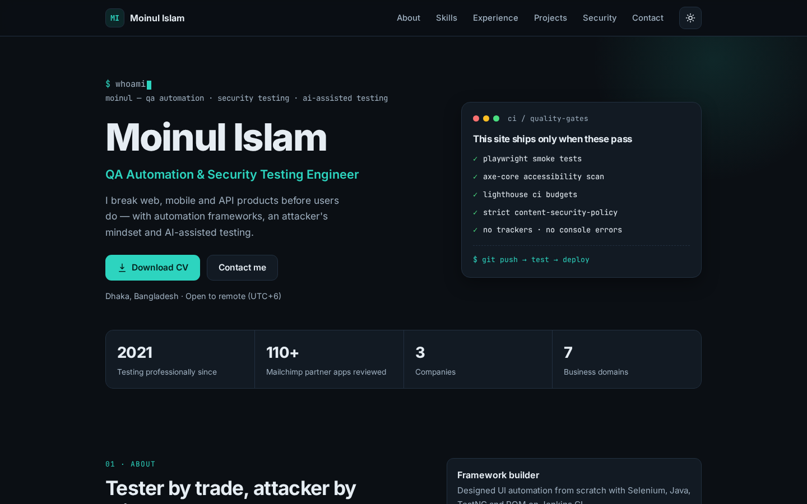

# Moinul Islam — Portfolio

[](https://github.com/mi-sabbir4545/mi-sabbir4545.github.io/actions/workflows/deploy.yml)

**Live site:** https://mi-sabbir4545.github.io  
**Live site (Cloudflare Pages):** https://moinulislam.pages.dev

Personal portfolio of **Moinul Islam**, a QA Automation & Security Testing Engineer. It covers web, mobile and API testing, AI-assisted testing with Claude Code, and security testing / VAPT.



## Why this repo is worth a look (for QA folks)

The site is plain HTML, CSS and JavaScript, but it is deployed like a production app. **Nothing reaches GitHub Pages unless every quality gate passes.**

| Gate | Tool | What it checks |
|---|---|---|
| Smoke tests | Playwright (desktop Chrome + Pixel 7) | Page loads, every section renders, in-page links resolve, CV download returns a PDF, theme toggle works and persists, mobile menu works, custom 404 |
| Accessibility | axe-core | No serious/critical WCAG 2.1 AA violations in **both** dark and light themes |
| Security hygiene | Playwright | Strict CSP is present (no `unsafe-inline`), external links use `noopener noreferrer`, no phone number is published |
| Stability | Playwright | Zero console errors, no horizontal scroll on mobile |
| Performance & SEO | Lighthouse CI | Accessibility, Best Practices and SEO ≥ 95 (hard fail); Performance ≥ 90 (warning) |

```
git push ──► Playwright + axe ──┐
         └─► Lighthouse CI ─────┴──► deploy to GitHub Pages (only if both pass)
```

## Security choices

- **Content-Security-Policy:** `default-src 'self'` with no inline scripts or styles and `object-src 'none'`.
- **Safe rendering:** all content is inserted with `textContent` and DOM APIs, never `innerHTML`, so the data file cannot inject markup.
- **No third parties:** fonts are self-hosted; there are no trackers, analytics or CDNs.
- **Privacy:** the public CV copy has no phone number or home address, and a test enforces it.
- **Least-privilege CI:** the workflow runs with `contents: read`. Only the deploy job gets `pages: write`.

## Tech stack

HTML5 · CSS (custom properties, dark/light themes) · vanilla JavaScript · Inter & JetBrains Mono (self-hosted) · Playwright · axe-core · Lighthouse CI · GitHub Actions · GitHub Pages

## Project structure

```
.
├── site/                      # everything that gets published
│   ├── index.html
│   ├── 404.html
│   ├── robots.txt · sitemap.xml
│   └── assets/
│       ├── js/data.js         # ← ALL website text lives here
│       ├── js/main.js         # renders data.js into the page
│       ├── js/theme-init.js   # sets theme before first paint
│       ├── css/styles.css
│       ├── fonts/             # self-hosted variable fonts (OFL)
│       ├── img/               # favicon + social share image
│       └── Moinul_Islam_CV.pdf
├── tests/portfolio.spec.js    # Playwright + axe test suite
├── playwright.config.js
├── lighthouserc.json
└── .github/workflows/deploy.yml
```

## Run it locally

Requires Node.js 22+.

```bash
npm install
npx playwright install chromium   # first time only
npm start                         # opens http://127.0.0.1:4173
npm test                          # runs the full test suite
npm run test:report               # opens the HTML report after a CI-style run
```

## Update the content

1. Edit `site/assets/js/data.js`. Name, skills, experience, projects and the security roadmap all live there.
2. To replace the CV, overwrite `site/assets/Moinul_Islam_CV.pdf` and keep the same file name.
3. Run `npm test`, then commit and push. The pipeline tests and deploys automatically.

## License

Code: MIT. Fonts: SIL Open Font License (see `site/assets/fonts/`).
